# Sample programs for bismite-library-core and bismite-library-ext in C language

- https://github.com/bismite/bismite-library-core
- https://github.com/bismite/bismite-library-ext

## timer
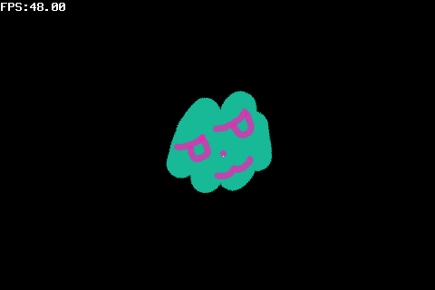

## hit
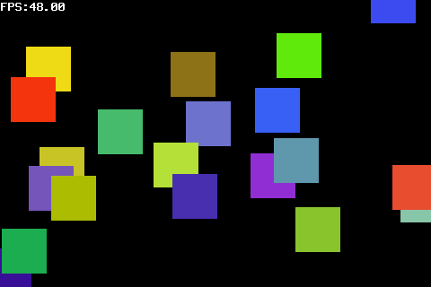

## event-keyboard
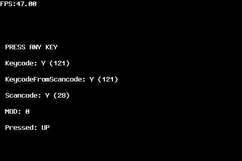

## texture-atlas
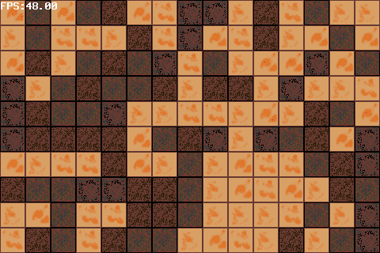

## texture
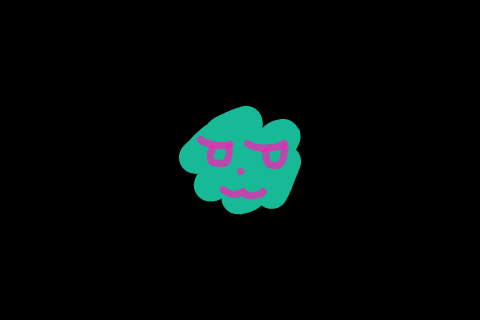

## event-touch
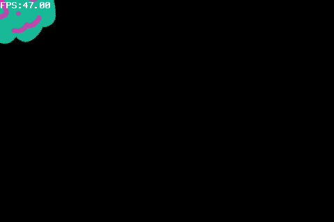

## action

## label
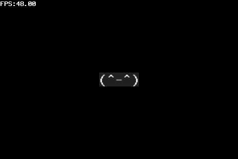

## layer-particle
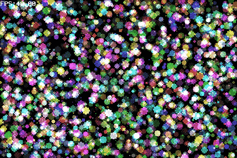

## layer-move
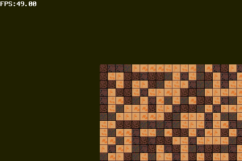

## layer-spotlight
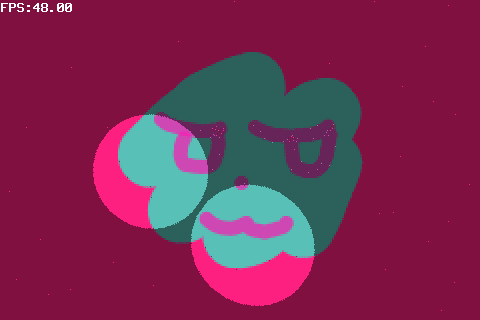

## event-textinput
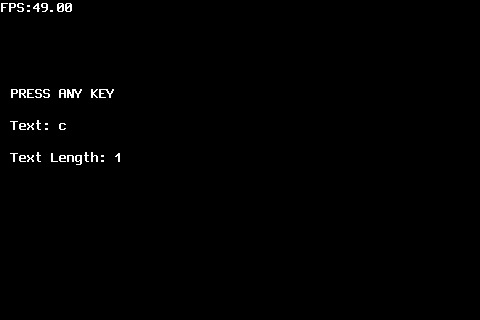
